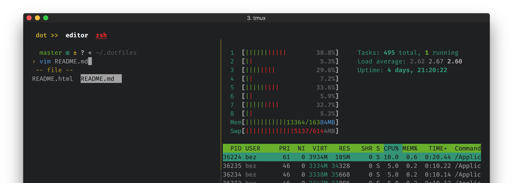

# dot ● files

#### my `zsh`, `neovim`, `tmux`, _etc._ configurations

---

Clone under `$HOME/.dotfiles` with `--recursive` flag

## Homebrew

```sh
# Install Homebrew
/usr/bin/ruby -e "$(curl -fsSL https://raw.githubusercontent.com/Homebrew/install/master/install)"
```

## Stow

I use [Stow](https://www.gnu.org/software/stow/) to put configuration directories/files where they need to be for tools to work:

```sh
# Install Stow
brew install stow

# Now, use Stow to put config dirs/files in place:
cd $HOME/.dotfiles
stow .
```

## tpm

Install `tpm`:

```sh
git clone https://github.com/tmux-plugins/tpm ~/.tmux/plugins/tpm
```

Start a new `tmux` session and invoke `C-s M-I` to install the plugins.

## atuin

```sh
brew install atuin
atuin login
```

## git

Create a `~/.gitconfig` file & include files from `~/.dotfiles/git` e.g.

```gitconfig
[include]
    path = ~/.dotfiles/git/gitconfig.base
    path = ~/.dotfiles/git/gitconfig.1password

# REQUIRED. `user` is unset in dotfile includes.
[user]
	name = Bez Hermoso
	email = ...
```

